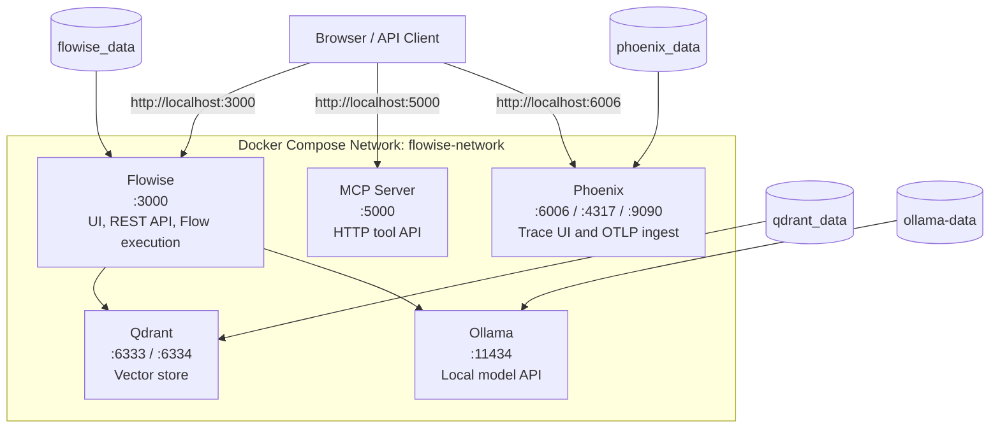

# Architecture Overview

This document describes the current Docker Compose architecture used in this repository and how the services interact.

## System Overview

The stack is centered on Flowise and runs on a single Docker bridge network named `flowise-network`.

The startup set is controlled by `COMPOSE_PROFILES` in `.env`. In the current `.env.example`, the default startup set enables all profiles:

- `flowise`
- `qdrant`
- `ollama`
- `mcp-server`
- `phoenix`

That means a plain `docker compose up -d` can bring up the full local playground unless you remove profiles from `.env`.

## Service Breakdown

### Flowise

**Container:** `flowise`  
**Image:** `flowiseai/flowise:3.1.1`  
**Profile:** `flowise`  
**Port:** `3000` mapped from `${FLOWISE_PORT:-3000}`

Flowise is the main application in the stack. It provides:

- the visual editor for chatflows and agentflows
- the REST API used to execute saved flows
- the runtime that connects to local or external model providers
- support for community nodes through `SHOW_COMMUNITY_NODES=true`

Current container configuration also sets:

- `DATABASE_PATH=/root/.flowise/flowise.db`
- `LOG_LEVEL=${LOG_LEVEL:-info}`
- `NODE_TLS_REJECT_UNAUTHORIZED=0`

**Persistence:**

- `flowise_data` mounted at `/root/.flowise`

This volume stores the SQLite database, flow definitions, credentials, and other Flowise state.

### Qdrant

**Container:** `qdrant`  
**Image:** `qdrant/qdrant:v1.16.2`  
**Profile:** `qdrant`  
**Ports:** `${QDRANT_PORT:-6333}:6333`, `${QDRANT_GRPC_PORT:-6334}:6334`

Qdrant is the vector database used for retrieval workflows.

Typical responsibilities:

- storing embeddings and collections
- serving semantic similarity search
- supporting RAG pipelines built in Flowise

**Persistence:**

- `qdrant_data` mounted at `/qdrant/storage`

**Connection from Flowise:**

- Host: `qdrant`
- Port: `6333`

### Ollama

**Container:** `ollama`  
**Image:** `ollama/ollama:0.13.3`  
**Profile:** `ollama`  
**Port:** `11434:11434`

Ollama provides the local model runtime used by Flowise.

In this repository, the container does not use the default entrypoint directly. Instead it runs [scripts/ollama-entrypoint.sh](../scripts/ollama-entrypoint.sh), which:

1. starts `ollama serve`
2. waits for the API to be ready
3. reads `OLLAMA_AUTO_PULL_MODELS`
4. pulls any missing models automatically

This makes local model startup reproducible across machines and avoids manual `ollama pull` steps for the configured models.

**Persistence:**

- `ollama-data` mounted at `/root/.ollama`

**Connection from Flowise:**

- Base URL: `http://ollama:11434`

### MCP Server

**Container:** `mcp-server`  
**Image:** `ghcr.io/estebanjosse/mcp-server-template:latest`  
**Profile:** `mcp-server`  
**Port:** `5000:5000`

The MCP server is an additional HTTP service exposed inside the same Docker network and on the host. It is intended to provide tool or integration endpoints alongside the Flowise playground.

Current configuration includes:

- `ASPNETCORE_ENVIRONMENT=Production`
- health endpoint on `http://localhost:5000/health`

This service is independent from Flowise at the Docker Compose level: Compose starts it on the same network, but there is no hardwired dependency between the two containers. Any integration happens at the application level.

### Phoenix

**Container:** `phoenix`  
**Image:** `arizephoenix/phoenix:13.20.0`  
**Profile:** `phoenix`  
**Ports:** `6006:6006`, `4317:4317`, `9090:9090`

Phoenix provides local observability for traces and evaluations.

Its main roles are:

- exposing the Phoenix UI on port `6006`
- receiving OTLP telemetry on port `4317`
- optionally exposing Prometheus-compatible metrics on port `9090`

**Persistence:**

- `phoenix_data` mounted at `/mnt/data`

Phoenix is available to the stack, but telemetry still needs to be emitted by instrumented clients or applications. Docker Compose only provides the service and network path.

## Runtime Relationships

### Main Flow Path

The main application path in this repository is:

1. the user opens Flowise in the browser
2. Flowise executes a chatflow or agentflow
3. Flowise can call Ollama for local inference
4. Flowise can call Qdrant for vector storage or retrieval

### Supporting Services

- `mcp-server` can be called by external clients or by flows that are configured to use it
- `phoenix` can receive traces from instrumented components when observability is enabled

### What Is Not Hard-Coupled

The Compose file does not declare `depends_on` relationships between services. In practice this means:

- services are loosely coupled
- you can start only the profiles you need
- application-level configuration determines whether Flowise actually uses Qdrant, Ollama, Phoenix, or the MCP server

## Network Architecture

All services join the `flowise-network` bridge network.

This gives the stack:

- service-to-service DNS resolution by container name
- isolation from unrelated Docker networks
- host access only through explicitly published ports

Container hostnames available inside the network include:

- `flowise`
- `qdrant`
- `ollama`
- `mcp-server`
- `phoenix`

## Volumes

| Volume | Purpose | Mount Point |
|--------|---------|-------------|
| `flowise_data` | Flowise database, flows, credentials, application state | `/root/.flowise` |
| `qdrant_data` | Qdrant vector collections and indexes | `/qdrant/storage` |
| `ollama-data` | Pulled Ollama models and local runtime data | `/root/.ollama` |
| `phoenix_data` | Phoenix traces and metadata | `/mnt/data` |

## Health Checks

The current Compose file defines health checks for the services that need readiness validation:

| Service | Health Check | Interval |
|---------|--------------|----------|
| `flowise` | `wget --spider -q http://localhost:3000` | `30s` |
| `qdrant` | `wget --spider -q http://localhost:6333/readyz` | `30s` |
| `ollama` | `/bin/ollama list` | `30s` |
| `mcp-server` | `curl -f http://localhost:5000/health` | `30s` |

Phoenix is exposed as part of the stack but does not currently define a Compose health check in `docker-compose.yml`.

## Configuration Surface

The main environment variables currently used by the stack are:

| Variable | Purpose | Default |
|----------|---------|---------|
| `COMPOSE_PROFILES` | Controls which services start with `docker compose up -d` | `flowise,qdrant,ollama,mcp-server,phoenix` |
| `FLOWISE_PORT` | Host port for the Flowise UI/API | `3000` |
| `LOG_LEVEL` | Flowise logging level | `info` |
| `QDRANT_PORT` | Host port for Qdrant REST API | `6333` |
| `QDRANT_GRPC_PORT` | Host port for Qdrant gRPC API | `6334` |
| `OLLAMA_AUTO_PULL_MODELS` | Comma-separated list of models auto-pulled at startup | `qwen2.5:0.5b` |

## Extending the Stack

If you add another service, the current architecture pattern is:

1. add the service to `docker-compose.yml`
2. attach it to `flowise-network`
3. publish only the ports you need externally
4. add a named volume if the service stores state
5. place it behind a dedicated Compose profile when it should remain optional

That keeps the playground modular while still making cross-service integration easy inside Docker.
